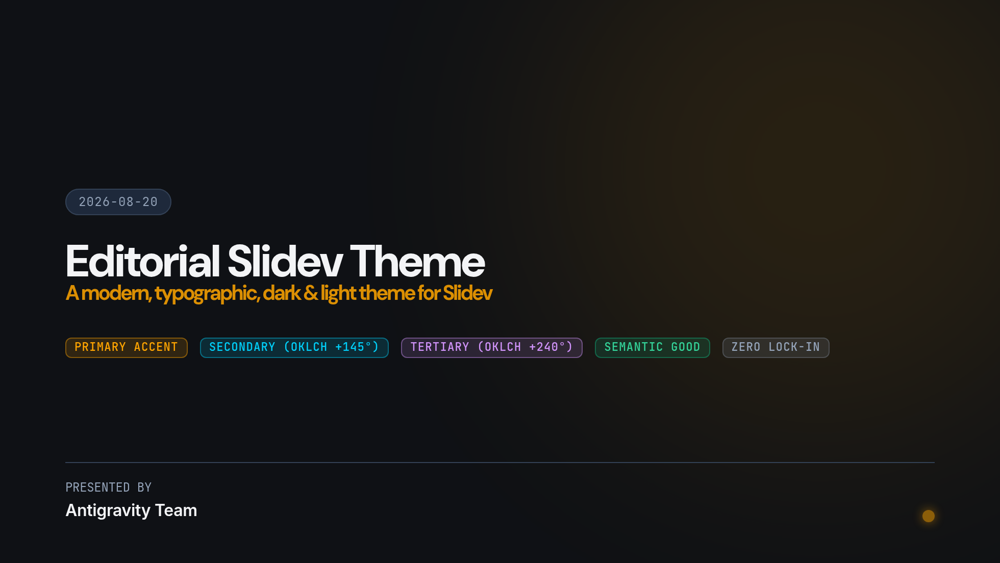
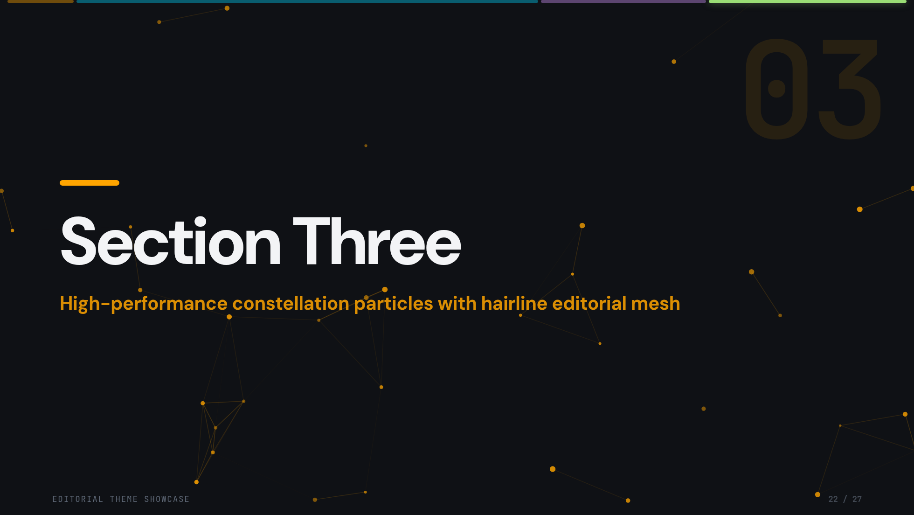
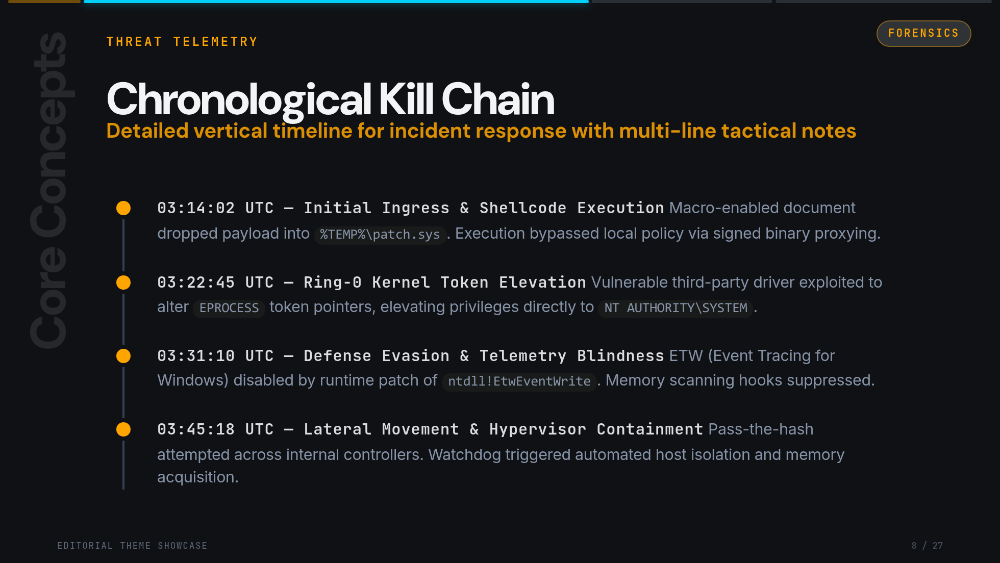
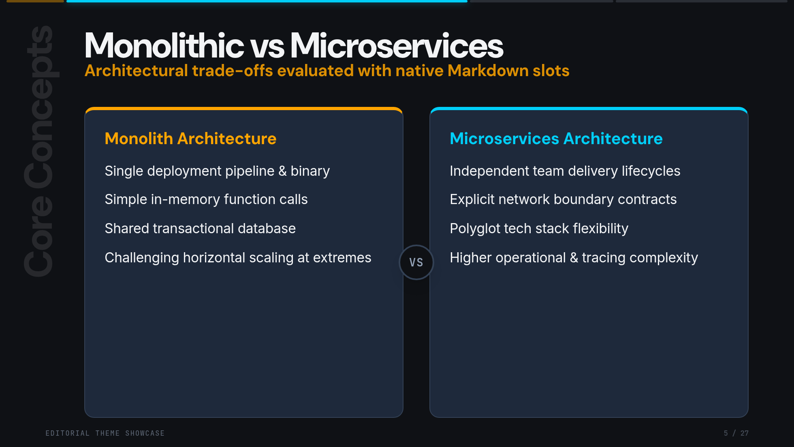
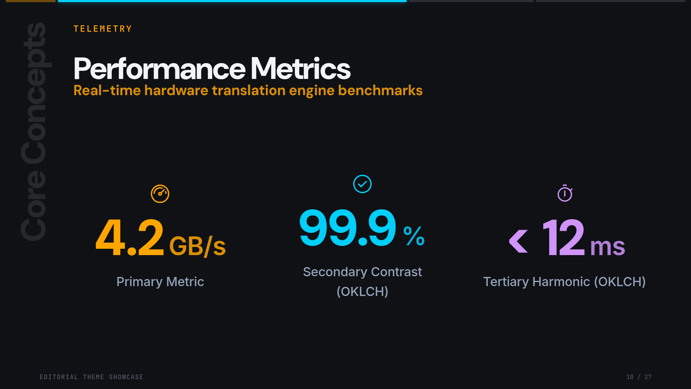
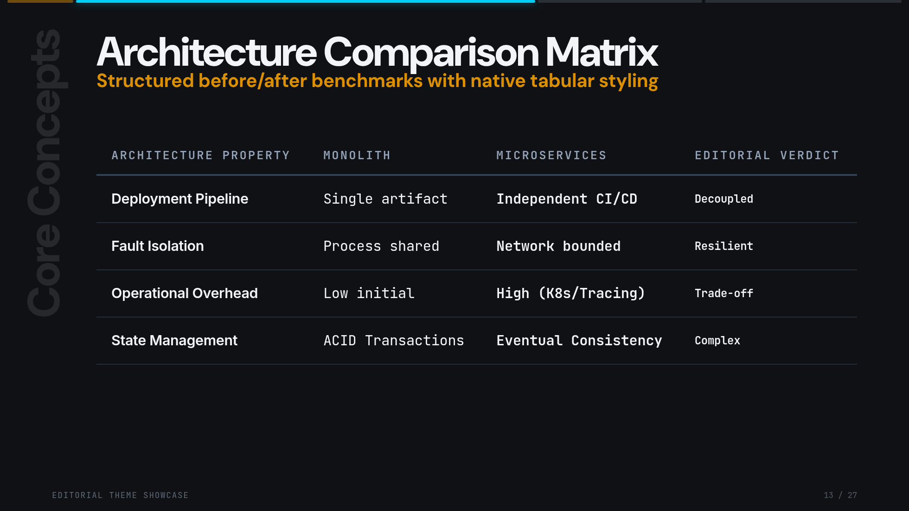
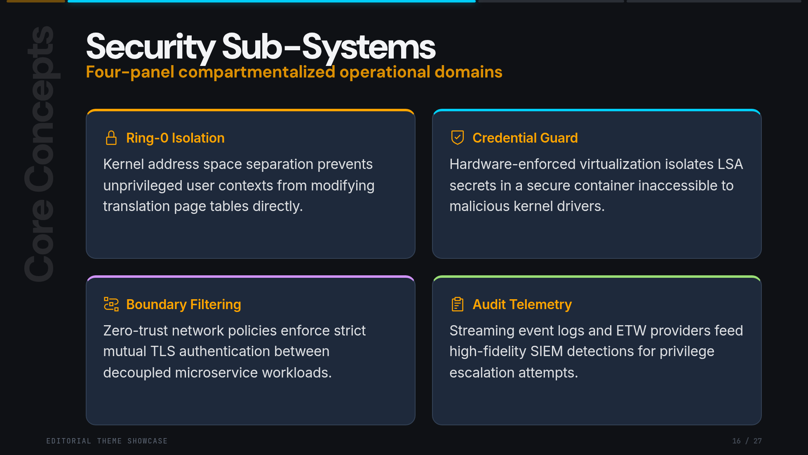
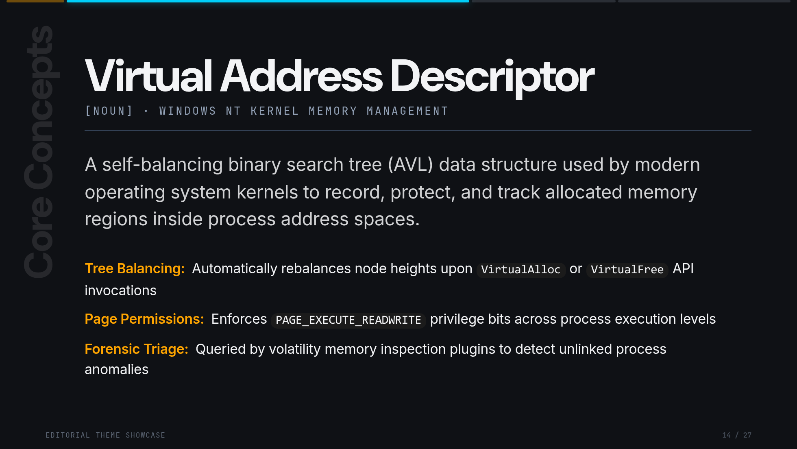
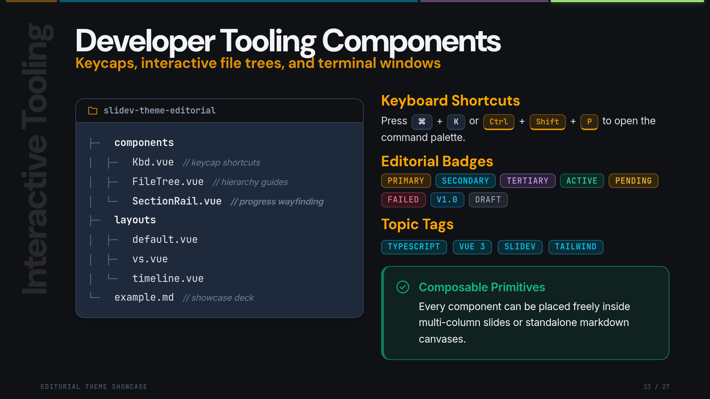

# slidev-theme-editorial

[](https://www.npmjs.com/package/slidev-theme-editorial)
[](https://opensource.org/licenses/MIT)
[](https://github.com/slidevjs/slidev)

An authoritative, dark-first editorial theme for [Slidev](https://github.com/slidevjs/slidev), crafted for high-stakes tech, cybersecurity, systems engineering, and research presentations.

<p align="center">
  
</p>

---

## Highlights

- **Typographic Authority**: Tri-font editorial hierarchy pairing **DM Sans** (bold geometric display), **Inter** (balanced reading prose), and **JetBrains Mono** (technical kickers, metadata, and code).
- **Perceptual OKLCH Multi-Accent System**: Automatic derivation of secondary (+145° hue shift) and tertiary (+240° hue shift) accents from a single primary brand color, eliminating visual fatigue in long decks.
- **Calibrated Dual-Mode**: Designed dark-first (`#0F1115`) with full WCAG AA-compliant light mode (`#FFFFFF`) luminance clamping.
- **Zero-Overhead Motion**: Native Canvas2D animations for section divider slides (Constellation Particles, Sinus Waves, Dot Grid) that cleanly halt to **0% CPU** when navigating away.
- **Rich Layout Library**: 20+ purpose-built slide layouts including vertical kill-chain timelines, adversarial comparisons, KPI metric grids, and technical definition canvases.

---

## Quick Start

Add the theme to your `slides.md` frontmatter. Slidev will automatically prompt you to install it:

```yaml
---
theme: editorial
---

# Presentation Title
### Presentation subtitle or kicker

- First bulletless editorial point
- Second strategic milestone
- Third key architectural takeaway
```

Or install it manually via your package manager:

```bash
npm install -D slidev-theme-editorial
# or
pnpm add -D slidev-theme-editorial
```

---

## Theme Configuration

Customize your presentation deck globally in `slides.md` frontmatter:

```yaml
---
theme: editorial
themeConfig:
  primary: '#FFA500'          # Primary brand accent (Default: Editorial Amber)
  secondary: '#0EA5E9'        # Optional override (Defaults to OKLCH +145° derivation)
  tertiary: '#A855F7'         # Optional override (Defaults to OKLCH +240° derivation)
  sectionEffect: 'particles'  # 'particles' | 'waves' | 'grid' | 'glow' | 'cube' | 'none' | 'random'
  sectionAccents: true        # Automatically rotate accents across chapters
---
```

---

## Layout Showcase & Catalog

### 1. Section Dividers & Motion

#### `layout: section`
Section dividers feature dynamic roman/arabic watermarks, top progress rails, full-screen background image dimming, and native Canvas2D background effects.

<p align="center">
  
</p>

```yaml
---
layout: section
title: Interactive Tooling
effect: particles      # 'particles' | 'waves' | 'grid' | 'glow' | 'cube'
accent: tertiary       # Switches section accent to tertiary (violet)
---

# Section Three

### High-performance constellation particles with hairline editorial mesh
```

---

### 2. Timelines & Incident Response

#### `layout: timeline-vertical`
A structured vertical spine timeline optimized for tactical forensics, incident response, vulnerability lifecycles, and chronological kill chains.

<p align="center">
  
</p>

```yaml
---
layout: timeline-vertical
kicker: Threat Telemetry
aside: Forensics
---

# Chronological Kill Chain
### Detailed vertical timeline for incident response with multi-line tactical notes

- **03:14:02 UTC — Initial Ingress & Execution** Macro-enabled payload dropped into `%TEMP%`.
- **03:22:45 UTC — Ring-0 Kernel Elevation** Vulnerable third-party driver exploited to alter tokens.
- **03:31:10 UTC — Telemetry Blindness** ETW event tracing hooks suppressed at runtime.
- **03:45:18 UTC — Lateral Movement** Watchdog triggers automated network containment.
```

---

### 3. Adversarial Analysis & Comparisons

#### `layout: vs`
Side-by-side comparison layout with contrasting accent top borders (Primary vs Secondary) and a centered divider token.

<p align="center">
  
</p>

```yaml
---
layout: vs
titleLeft: Monolith Architecture
titleRight: Microservices Architecture
kicker: Architecture Trade-offs
---

# Monolithic vs Microservices
### Architectural trade-offs evaluated with native Markdown slots

::left::
- Single deployment pipeline & binary
- Simple in-memory function calls
- Shared transactional database
- Challenging horizontal scaling at extremes

::right::
- Independent team delivery lifecycles
- Explicit network boundary contracts
- Polyglot tech stack flexibility
- Higher operational & tracing complexity
```

---

### 4. Data & Metrics

#### `layout: stats`
Display 2 to 4 monumental KPI metrics formatted as bordered cards with icons and multi-accent categorical ramps.

<p align="center">
  
</p>

```yaml
---
layout: stats
kicker: Telemetry
items:
  - value: "4.2 GB/s"
    label: "Primary Metric"
    icon: "i-carbon-dashboard"
    tone: "primary"
  - value: "99.9%"
    label: "Secondary Contrast (OKLCH)"
    icon: "i-carbon-checkmark-outline"
    tone: "secondary"
  - value: "< 12 ms"
    label: "Tertiary Harmonic (OKLCH)"
    icon: "i-carbon-timer"
    tone: "tertiary"
---

# Performance Metrics
### Real-time hardware translation engine benchmarks
```

---

### 5. Multi-Row Matrix Tables

#### `layout: compare`
Tabular benchmark grid with monospace column alignments and highlighted delta verdicts.

<p align="center">
  
</p>

```yaml
---
layout: compare
columns: ['Architecture Property', 'Monolith', 'Microservices', 'Editorial Verdict']
rows:
  - { metric: 'Deployment Pipeline', before: 'Single artifact', after: 'Independent CI/CD', delta: 'Decoupled' }
  - { metric: 'Fault Isolation', before: 'Process shared', after: 'Network bounded', delta: 'Resilient' }
  - { metric: 'Operational Overhead', before: 'Low initial', after: 'High (K8s/Tracing)', delta: 'Trade-off' }
  - { metric: 'State Management', before: 'ACID Transactions', after: 'Eventual Consistency', delta: 'Complex' }
---

# Architecture Comparison Matrix
### Structured before/after benchmarks with native tabular styling
```

---

### 6. Card Decks & Feature Grids

#### `layout: panels`
Four-panel modular card layout with alternating categorical top accents (`--cat-1` through `--cat-4`).

<p align="center">
  
</p>

```yaml
---
layout: panels
cards:
  - title: Ring-0 Isolation
    icon: i-carbon-locked
    desc: Kernel address space separation prevents unprivileged user contexts from modifying translation tables.
  - title: Credential Guard
    icon: i-carbon-security
    desc: Hardware-enforced virtualization isolates LSA secrets in a secure container.
  - title: Boundary Filtering
    icon: i-carbon-network-3
    desc: Zero-trust network policies enforce strict mutual TLS authentication between decoupled microservices.
  - title: Audit Telemetry
    icon: i-carbon-document
    desc: Streaming event logs and ETW providers feed high-fidelity SIEM detections.
---

# Security Sub-Systems
### Four-panel compartmentalized operational domains
```

---

### 7. Technical Terminology & Deep Dives

#### `layout: define`
Formal dictionary/lexicon layout for technical terminology, complete with part-of-speech tag, phonetic classification, and definition bullets.

<p align="center">
  
</p>

```yaml
---
layout: define
term: Virtual Address Descriptor
partOfSpeech: "[NOUN] • WINDOWS NT KERNEL MEMORY MANAGEMENT"
---

A self-balancing binary search tree (AVL) data structure used by modern operating system kernels to record, protect, and track allocated memory regions inside process address spaces.

- **Tree Balancing:** Automatically rebalances node heights upon `VirtualAlloc` or `VirtualFree` API invocations
- **Page Permissions:** Enforces `PAGE_EXECUTE_READWRITE` privilege bits across process execution levels
- **Forensic Triage:** Queried by volatility memory inspection plugins to detect unlinked process anomalies
```

---

## Built-in Editorial Components

<p align="center">
  
</p>

### Badges & Tags
Crisp monospace status badges with native `color-mix` translucency and light-mode contrast calibration:

```html
<!-- Semantic Badges -->
<Badge tone="primary">Primary</Badge>
<Badge tone="secondary">Secondary</Badge>
<Badge tone="tertiary">Tertiary</Badge>
<Badge tone="good">Active</Badge>
<Badge tone="warn">Pending</Badge>
<Badge tone="bad">Failed</Badge>
<Badge tone="info">v1.0</Badge>
<Badge tone="muted">Draft</Badge>

<!-- Categorized Topic Tags -->
<Tags :items="['TypeScript', 'Vue 3', 'Slidev', 'Tailwind']" tone="secondary" />
```

### Developer Keycaps & File Trees
```html
<!-- Keycap shortcuts -->
<p>Press <Kbd>⌘</Kbd> + <Kbd>K</Kbd> or <Kbd tone="accent">Ctrl</Kbd> + <Kbd tone="accent">P</Kbd></p>

<!-- Interactive File Hierarchy -->
<FileTree title="slidev-theme-editorial" :items="[
  { name: 'components', children: [
    { name: 'Badge.vue', desc: 'status pills' },
    { name: 'SectionParticles.vue', highlight: true, desc: 'constellation mesh' }
  ]},
  { name: 'layouts', children: [
    { name: 'timeline-vertical.vue', desc: 'incident kill chain' },
    { name: 'vs.vue', desc: 'adversarial comparison' }
  ]}
]" />
```

### Terminal Windows & Callout Blocks
```html
<!-- Mock Shell Terminal -->
<Terminal title="volatility3" :lines="[
  { prompt: '$', cmd: 'vol -f memory.raw windows.pslist' },
  { out: 'PID    PPID   ImageFileName      Offset' },
  { out: '4      0      System             0xfa800100' }
]" />

<!-- Editorial Callout -->
<Callout tone="tip" title="Composable Primitives">
  Every component can be placed freely inside multi-column slides or standalone markdown canvases.
</Callout>
```

---

## Slide Frontmatter API Reference

| Key | Type | Description |
| :--- | :--- | :--- |
| `layout` | `string` | The slide layout name (e.g. `cover`, `section`, `vs`, `timeline-vertical`, `stats`, `compare`, `define`, etc.). |
| `accent` | `'primary' \| 'secondary' \| 'tertiary'` | Switches the active accent color for the entire slide (headers, kickers, aside pills, bullets). |
| `kicker` | `string` | Uppercase monospace category label placed above the slide's main title. |
| `aside` | `string` | Monospace pill badge pinned to the top-right corner of the slide (e.g. `aside: Deep Dive`). |
| `effect` | `string` | (`layout: section` only) Background animation effect: `'particles'`, `'waves'`, `'grid'`, `'glow'`, `'cube'`, `'none'`, or `'random'`. |
| `watermark` | `boolean \| string \| number` | (`layout: section` only) Custom watermark text or number. Pass `false` to disable. |
| `image` | `string` | (`layout: section` / `image-right` / `intro-image`) Full-screen or column background image URL. |
| `imageOpacity` | `number` | (`layout: section` only) Translucency of background image (default: `0.18`). |
| `scrim` | `boolean` | (`layout: section` only) Renders a gradient fade over background images for text legibility (default: `true`). |
| `bullets` | `boolean` | Set `true` to opt into classic bullet icons for unordered lists on this slide. |
| `dense` | `boolean` | Tightens vertical padding and heading margins for information-dense slides. |

---

## Development

```bash
# Clone the repository
git clone https://github.com/valorcz/slidev-theme-editorial.git
cd slidev-theme-editorial

# Install dependencies
pnpm install

# Start local Slidev development server with example deck
pnpm dev

# Build the presentation
pnpm build

# Export full deck to PNG screenshots
pnpm screenshot
```

---

## License

MIT © [Vašek Lorenc](https://github.com/valorcz)
